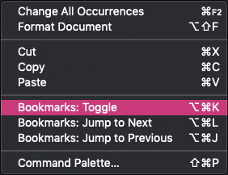
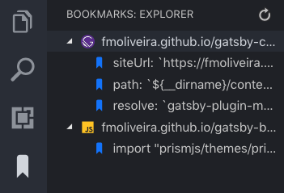
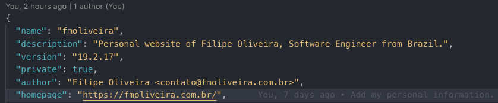
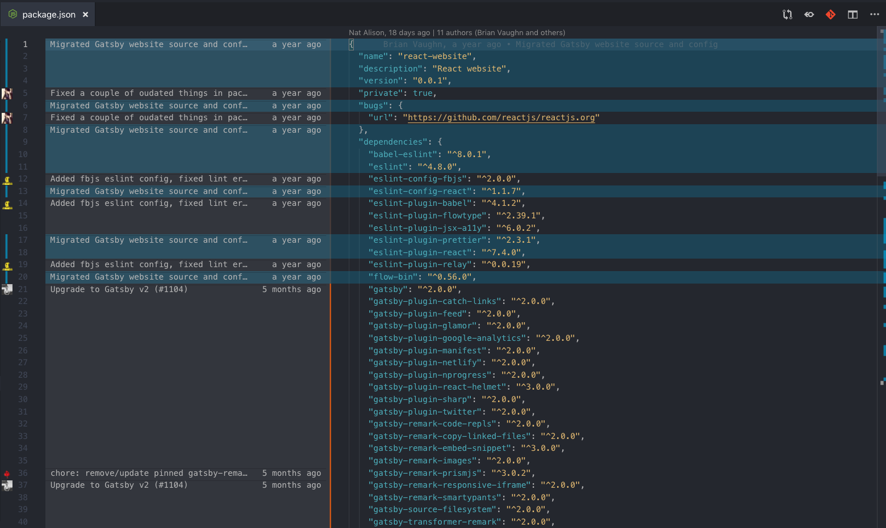
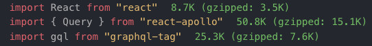
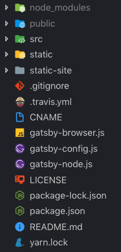

I've recently switched back to VS Code and I'm really glad to see how its community is growing so much and what awesome extensions we have out there. Here I will highlight the top extensions that help me being more productive in a daily basis.

## Bookmarks

> Mark lines and jump to them

It's simple as that: bookmark lines in one or multiple files, and jump between them very easily. You can right click in your editor until you get used to the hotkeys.

It also adds a very nice pane in your activity bar that shows all your bookmarks across different files.

- [Install Bookmarks](vscode:extension/alefragnani.Bookmarks)

## GitLens

> Supercharge the Git capabilities built into Visual Studio Code

I'm probably underusing this extension, but its most basic features are already very helpful. I really enjoy the Git tab that is built into VS Code, but GitLens takes it to another level.

To start with, it adds autorship information at the top of the open file, and as well as into the current line - a nice and quick way to sneak peek on who and when last modified a file or a specific line.

Cool addon, but it's fortunately greyed out to make sure I'm not anxiously looking at it all the time. For a better autorship analysis, you can press a button with the Git icon in the top right corner of your editor and visualise Git blame annotations, which are very useful to quickly lookup when a change was committed and who is the author, so you know who to talk to and discuss about that code.

- [Install GitLens](vscode:extension/eamodio.gitlens)

## Import Cost

> Display import/require package size in the editor

This one is a very handy way to help you constantly being aware about the cost of all the imports in your code.

[Install Import Cost](vscode:extension/wix.vscode-import-cost)

## Test Explorer UI

> Run your tests in the Sidebar of Visual Studio Code

I don't like to switch between VS Code and Terminal windows all the time to check the progress of my tests, and I also don't enjoy the layout of the terminal integrated into VS Code. Being able to run my tests in the sidebar of the editor is really an exciting idea. I used it all the time when I worked with C#.NET in the full Visual Studio IDE, and it's awesome to see an effort to bring it to VS Code.

While I still see some points of improvement for this extension and I'll try to contribute with the project, it may be useful to install it right away and see how you can benefit from it!

- [Instal Test Explorer UI](vscode:extension/hbenl.vscode-test-explorer) (required)
- [Install Jest Test Adapter](vscode:extension/rtbenfield.vscode-jest-test-adapter) (if you are using Jest)

If you are using another test framework, you will need a corresponding test adapter. Please check the [Test Explorer UI](vscode:extension/hbenl.vscode-test-explorer) readme for available test adapters.

## Prettier

> VS Code plugin for prettier

Prettier is a life saver that formats all your team's code in a consistent style. This extension allows you to automatically format your code with Prettier whenever you save it. If you're not familiar with it, read more on <a href="https://prettier.io/" target="_blank" rel="noopener noreferrer">Prettier's website</a>.

What I most love about Prettier is having few options, which leads to less discussions about style. I like to turn off semicolons in my personal projects, but if I'm working in a project with these, I don't have to worry about it because Prettier will add them for me.

- [Install Prettier](vscode:extension/esbenp.prettier-vscode)

## Material Icon Theme

> Material Design Icons for Visual Studio Code

This icon set is really enjoyable and makes the sidebar more elegant and easier to read.

- [Instal Material Icon Theme](vscode:extension/pkief.material-icon-theme)

## One Monokai Theme

> A cross between Monokai and One Dark theme

This is the theme I'm using. I really like it because it's not too dark and very pleasant to my eyes. Themes are a very personal choice, but if you like dark themes, go take a look and experiment it yourself.

- [Experiment One Monokai Theme](vscode:extension/azemoh.one-monokai)
